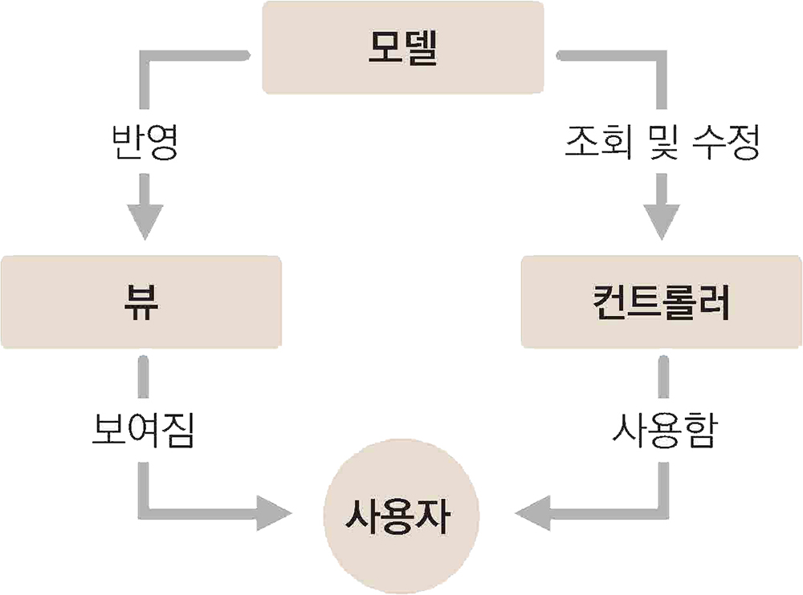
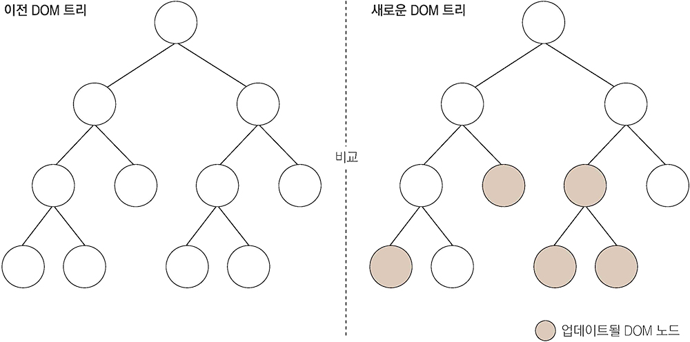
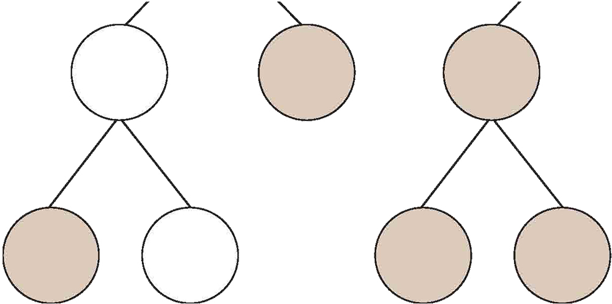

## 왜 리액트인가?

한때 자바스크립트는 웹 브라우저에서 간단한 연산을 하거나 시각적인 효과를 주는 단순한 스크립트 언어에 불과했지만, 현재는 웹 애플리케이션에서 가장 핵심적인 역할을 합니다. 더 나아가 영역을 확장하여 서버 사이드는 물론 모바일, 데스크톱 애플리케이션에서도 엄청나게 활약합니다.

이제 자바스크립트만으로도 규모가 큰 애플리케이션을 만들 수 있는 시대가 왔습니다. 대규모 애플리케이션 중 프런트엔드 사이드에서 돌아가는 애플리케이션 구조를 관리하려면 어떻게 해야 할까요? 솔직히 이런 애플리케이션을 특별한 도구 없이 순수하게 자바스크립트로만 관리하려면 골치 아프겠죠? 지금까지 수많은 프레임워크가 조금씩 다른 관점에서 이를 해결하려고 노력해 왔습니다.

이 프레임워크들은 주로 MVC(Model-View-Controller) 아키텍처, MVVM(Model-View-View Model) 아키텍처를 사용합니다. AngularJS의 경우는 MVW(Model-View-Whatever) 아키텍처로 애플리케이션을 구조화하죠.

MVC, MVVM, MVW 등과 같은 여러 구조가 지닌 공통점은 모델(Model)과 뷰(View)가 있다는 것인데요. 모델은 애플리케이션에서 사용하는 데이터를 관리하는 영역이고, 뷰는 사용자에게 보이는 부분입니다. 프로그램이 사용자에게서 어떤 작업(예: 버튼 클릭, 텍스트 입력 등)을 받으면 컨트롤러는 모델 데이터를 조회하거나 수정하고, 변경된 사항을 뷰에 반영합니다.

뷰를 변형(mutate)하는 과정에서 항목에 따라 어떤 부분을 찾아서 변경할지 규칙을 정하는 작업은 간단하지만, 애플리케이션 규모가 크면 상당히 복잡해지고 제대로 관리하지 않으면 성능도 떨어질 수 있습니다.

어떤 데이터가 변할 때마다 어떤 변화를 줄지 고민하는 것이 아니라 그냥 기존 뷰를 날려 버리고 처음부터 새로 렌더링하는 방식입니다. 이렇게 하면 애플리케이션 구조가 매우 간단하고, 작성해야 할 코드양도 많이 줄어듭니다. 더 이상 어떻게 변화를 줄지 신경 쓸 필요가 없고, 그저 뷰가 어떻게 생길지 선언하며, 데이터에 변화가 있으면 기존에 있던 것은 버리고 정해진 규칙에 따라 새로 렌더링하면 되니까요.

그런데 이것이 과연 가능할까요? 웹 브라우저에서 이 방식대로 하면 CPU 점유율도 크게 증가할 텐데요. DOM은 느리니까요. 메모리도 많이 사용할 것이고요. 그리고 사용자가 인풋 박스에 텍스트를 입력할 때 기존에 렌더링된 것은 사라지고, 새로 렌더링하면 끊김 현상이 발생할 것입니다.

페이스북 개발 팀이 앞서 설명한 방식으로 최대한 성능을 아끼고 편안한 사용자 경험(user experience)을 제공하면서 구현하고자 개발한 것이 바로 리액트(React)입니다.

## 리액트 이해
리액트는 자바스크립트 라이브러리로 사용자 인터페이스를 만드는 데 사용합니다. 구조가 MVC, MVW 등인 프레임워크와 달리, 오직 V(View)만 신경 쓰는 라이브러리입니다.

리액트 프로젝트에서 특정 부분이 어떻게 생길지 정하는 선언체가 있는데, 이를 컴포넌트(component)라고 합니다. 컴포넌트는 다른 프레임워크에서 사용자 인터페이스를 다룰 때 사용하는 템플릿과는 다른 개념입니다. 템플릿은 보통 데이터셋이 주어지면 HTML 태그 형식을 문자열로 반환하는데, 이와 달리 컴포넌트는 좀 더 복합적인 개념입니다. 컴포넌트는 재사용이 가능한 API로 수많은 기능들을 내장하고 있으며, 컴포넌트 하나에서 해당 컴포넌트의 생김새와 작동 방식을 정의합니다.

사용자 화면에 뷰를 보여 주는 것을 렌더링이라고 합니다. 리액트 라이브러리는 뷰를 어떻게 렌더링하길래 데이터가 변할 때마다 새롭게 리렌더링하면서 성능을 아끼고, 최적의 사용자 경험을 제공할 수 있을까요? 이 비밀을 파악하려면 리액트 컴포넌트가 최초로 실행한 ‘초기 렌더링’과 컴포넌트의 데이터 변경으로 다시 실행되는 ‘리렌더링’ 개념을 이해해야 합니다.

### 초기 렌더링

어떤 UI 관련 프레임워크, 라이브러리를 사용하든지 간에 맨 처음 어떻게 보일지를 정하는 초기 렌더링이 필요합니다. 리액트에서는 이를 다루는 render 함수가 있습니다.

render() { ... }
이 함수는 컴포넌트가 어떻게 생겼는지 정의하는 역할을 합니다. 이 함수는 html 형식의 문자열을 반환하지 않고, 뷰가 어떻게 생겼고 어떻게 작동하는지에 대한 정보를 지닌 객체를 반환합니다. 컴포넌트 내부에는 또 다른 컴포넌트들이 들어갈 수 있습니다. 이때 render 함수를 실행하면 그 내부에 있는 컴포넌트들도 재귀적으로 렌더링합니다. 이렇게 최상위 컴포넌트의 렌더링 작업이 끝나면 지니고 있는 정보들을 사용하여 HTML 마크업(markup)을 만들고, 이를 우리가 정하는 실제 페이지의 DOM 요소 안에 주입합니다.

컴포넌트를 실제 페이지에 렌더링할 때는 분리된 두 가지 절차를 따르는데요. 먼저 문자열 형태의 HTML 코드를 생성한 후 특정 DOM에 해당 내용을 주입하면 이벤트가 적용됩니다

### 조화 과정
리액트 라이브러리에서 중요한 부분인 업데이트를 어떻게 진행하는지 한번 알아봅시다. 우선 리액트에서 뷰를 업데이트할 때는 “업데이트 과정을 거친다”라고 하기보다는 “조화 과정(reconciliation)을 거친다”라고 하는 것이 더 정확한 표현입니다. 컴포넌트에서 데이터에 변화가 있을 때 우리가 보기에는 변화에 따라 뷰가 변형되는 것처럼 보이지만, 사실은 새로운 요소로 갈아 끼우기 때문입니다.

이 작업 또한 render 함수가 맡아서 합니다. render 함수는 뷰가 어떻게 생겼고 어떻게 작동하는지에 대한 정보를 지닌 객체를 반환한다고 했었죠? 컴포넌트는 데이터를 업데이트했을 때 단순히 업데이트한 값을 수정하는 것이 아니라, 새로운 데이터를 가지고 render 함수를 또 다시 호출합니다. 그러면 그 데이터를 지닌 뷰를 생성해 내겠죠?

하지만 이때 render 함수가 반환하는 결과를 곧바로 DOM에 반영하지 않고, 이전에 render 함수가 만들었던 컴포넌트 정보와 현재 render 함수가 만든 컴포넌트 정보를 비교합니다.

▲ 그림 1-6 두 DOM 비교

자바스크립트를 사용하여 두 가지 뷰를 최소한의 연산으로 비교한 후, 둘의 차이를 알아내 최소한의 연산으로 DOM 트리를 업데이트하는 것이죠.

▲ DOM 트리의 차이 확인

결국 방식 자체는 루트 노드부터 시작하여 전체 컴포넌트를 처음부터 다시 렌더링하는 것처럼 보이지만, 사실 최적의 자원을 사용하여 이를 수행하는 것입니다.

리액트가 어떻게 작동하는지 큰 그림이 그려지나요? 더 구체적으로 이해하려면 다음 절에서 다룰 Virtual DOM을 알아야 합니다.